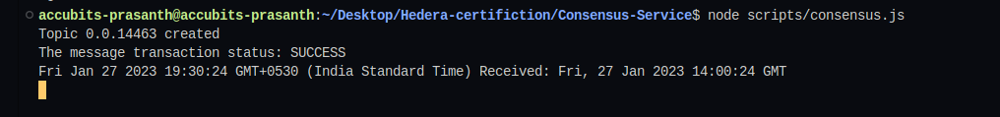

# Task : Consensus Service

Create a script to create a consensus transaction on the Hedera
Consensus Service using Account1. Write the current time in the
message of the transaction and submit.

## Instructions

1. `npm i` to install dependent packages
2. Add missing values to `sample.env` and change its name to `.env`

3. To run the script `npm run start`
4. Sample output:
   
