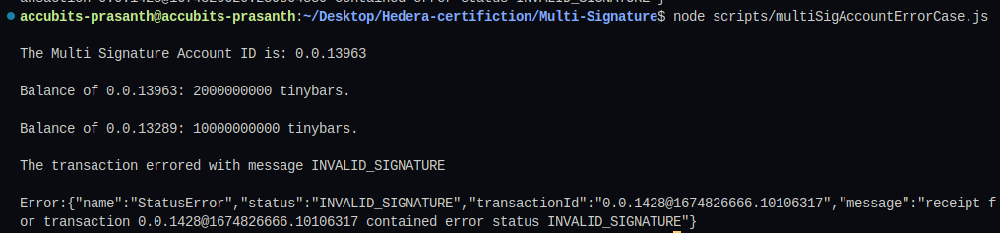
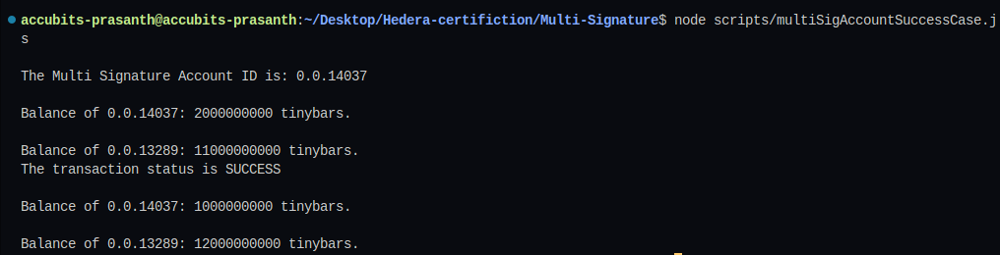

# Task : Multi Signature

Create a new wallet with an initial balance of 20 Hbar, and 3 keys
(Account1, Account2 and Account3) in a key list, with a key
threshold of 2 (2 Signers out of the three keys must sign).
Create transaction to transfer 10 Hbar to Account4 and sign it with
Account1 only, show that the transfer fails.
Now create a new transaction where Account1 and Account2
sign the transaction and show that the transfer succeeds.

## Instructions

1. `npm i` to install dependent packages
2. Add missing values to `sample.env` and change its name to `.env`

3. To run the script `node scripts/multiSigAccountSuccessCase.js` and `node scripts/multiSigAccountFailureCase.js`
4. Sample output
   
   
