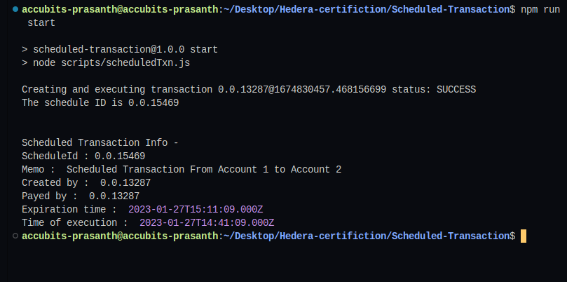

# Task : Scheduled Transaction

Create a script that creates a scheduled transaction to transfer 10
Hbar from Account1 to Account2.
Serialize and export the transaction to a base 64 format and use
this as the input to the next step.
Make a second script that reads in the serialized format and
provides the required signature and submit it.

## Instructions

1. `npm i` to install dependent packages
2. Add missing values to `sample.env` and change its name to `.env`

3. To run the script `node scripts/scheduledTxn.js`
4. Sample output
   
