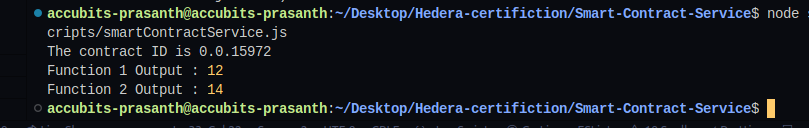

# Task : Scheduled Transaction

Download and deploy the solidity bytecode given below using the
Hedera Smart Contract Service and Account1. Call function
“function1” with parameters “4” and “3” and print the answer you
receive. Hint: there are 2 input parameters, and you will receive a
return value. Further information is in the ABI file. All parameters
are of type “uint16”.
Create a second transaction using function “function2” and supply
the result of “function1” as the input.
Extra credit: Decode and print the return value from the
transactions using ABI decoding.

## Instructions

1. `npm i` to install dependent packages
2. Add missing values to `sample.env` and change its name to `.env`

3. To run the script `node scripts/smartContractService.js`
4. Sample output
   
