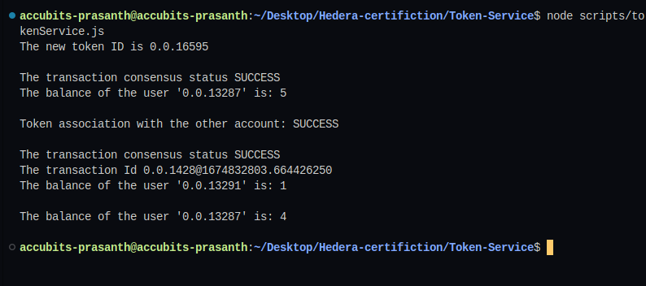

# Task : Token Service

Create a script that creates a non-fungible token with the Hedera
Token Service belonging to Account1.
Set the initial supply to 0 and the maxSupply for 5. Create a
custom royalty fee of 10% and a fallback fee of 200 Hbar paid to
Account2.
Create a second script that mints all 5 NFTs with the Metadata
“NFT x” and sends the second NFT to Account3.

## Instructions

1. `npm i` to install dependent packages
2. Add missing values to `sample.env` and change its name to `.env`

3. To run the script `node scripts/tokenService.js`
4. Sample output
   
